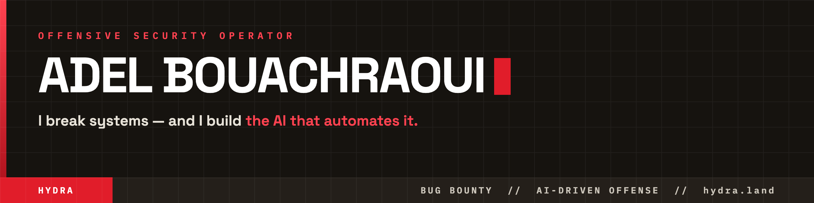

<!-- Profile README for github.com/Popy21 — repo must be named exactly "Popy21" -->

  
  
  
  
  

---

### `whoami`

Offensive security researcher & full-stack engineer. I **break web, infrastructure and AI systems** — and I **build the tooling that scales it**. Bug-bounty hunter on **YesWeHack** (53 reports) and **Apple** — **credited in WebKit [CVE-2026-28962](https://support.apple.com/en-us/127121)**. Every finding backed by a working PoC, never theoretical. Finishing a Cybersecurity Master's (work-study) in the south of France.

> Method: source-driven auditing and invariant reasoning over blind fuzzing — *"look where people don't look."*

---

### 🐉 HYDRA — autonomous AI offensive-security engine &nbsp;·&nbsp; [hydra.land](https://hydra.land)

My flagship: a system that runs the offensive loop on its own and **only reports what it can prove**.

- **Multi-model agent arena** — chains recon → exploitation → validation against a live target.
- **Exploit-proof gate** — a finding is promoted to High/Critical only when a *real exploit oracle* fires **and** several agents reach consensus. No reflection-only "RCE", no false positives.
- **Out-of-band collector** — proves blind RCE / SSRF end-to-end.
- **Cross-engagement memory** — primes new hunts and de-duplicates against prior work.

`Python` · `multi-LLM orchestration` · `Kali tooling` · `Docker` · `Traefik`

---

### 🎯 Vulnerability research & bug bounty

- 🍎 **Apple WebKit — [CVE-2026-28962](https://support.apple.com/en-us/127121)** · Safari 26.5, May 2026 — *malicious web content → sensitive-information disclosure.* Credited by name.
- 🎯 **[53 reports on YesWeHack](https://yeswehack.com/hunters/BaguettePwnM)** · KYC-verified, alias `BaguettePwnM` — across health, public-sector & fintech.

Classes: `DOM-XSS` · `Open Redirect` · `IDOR` · `Broken Access Control` · `SSRF`

> ⚠️ **Responsible disclosure.** Live-target findings are reported privately through the relevant program and are **not** published here. What you'll find in my public repos is **CTF write-ups, lab PoCs against intentionally-vulnerable targets, my own tooling, and findings that have been publicly disclosed**. No undisclosed exploit code, ever.

### 📰 Also building — [claudenews.online](https://claudenews.online)

An independent AI-intelligence publication: **16 thematic dossiers** (sovereign AI, AI agents, AI & cybersecurity, regulation, open-source models…). I live in the AI world I attack.

---

### 🧰 Arsenal

**Offense** · web exploitation (XSS / CSRF / SQLi / IDOR / access-control / open-redirect), PoC dev, recon
**Systems** · Kali · BlackArch · Windows AD & Server · Docker · Nginx/Apache · TCP/IP · VPN · firewalls
**Code** · Python · C# · Java · Swift · JS/TS (React, Next, Vue, Angular, Node) · PHP/Laravel
**Governance** · ISO 27001 · GDPR (ANSSI) · IGI 1300

---

### 📌 What to pin here

<!-- Create these public repos and pin them (Customize your pins on your profile). Keep everything sanitized per the disclosure note above. -->
- **`hydra`** — public face / teaser of the HYDRA engine (open-source the safe parts you choose)
- **`ctf-writeups`** — solved challenges, root-to-flag chains
- **`security-research`** — lab PoCs, disclosed findings, methodology notes
- **`offensive-tooling`** — small recon/exploitation utilities you wrote

---

  
  

  <a href="https://hydra.land"><b>hydra.land</b></a> &nbsp;·&nbsp;
  <a href="https://www.linkedin.com/in/adel-bouachraoui-8407a4234/">LinkedIn</a> &nbsp;·&nbsp;
  <a href="mailto:adelb13000@gmail.com">adelb13000@gmail.com</a>
   HÉRA SASU — independent security &amp; AI R&amp;D · references &amp; PoCs on request

